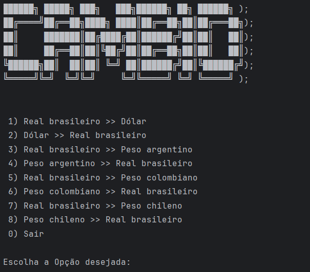

<h1 align="center"> Conversor de moedas 2000 </h1>

<a id="topo"></a>

## Índice 

- [Descrição do projeto](#descrição-do-projeto)
- [Status do projeto](#status-do-projeto)
- [Configuração de ambiente](#configuração-de-ambiente)
- [Consumo da API](#consumo-da-api)
- [Exibição de Resultados aos Usuários](#exibição-de-resultados-aos-usuários)


# Descrição do projeto

Este repositório apresenta o desafio do Conversor de Moedas, para os alunos da formação de back-end Java do programa [ONE](https://www.oracle.com/br/education/oracle-next-education/) praticarem suas habilidades. O desafio visa desenvolver uma aplicação via console para realizar as conversão de cambio em tempo real. Os dados são recebidos via uma API pública [ExchangeRate-API](https://www.exchangerate-api.com/) para efetuar o processo de cambio entre as moedas.
Objetivo final do desafio é fazer consumo de API e aplicar os conceitos visto durante a formação! Que seria orientação a Objeto / POO


<p align="center">

<br>

</p>

<p align="right">
  <a href="#topo" style="text-decoration: none; background-color: #007bff; color: white; padding: 10px 10px; border-radius: 5px;">Voltar ao Topo</a>
</p>

# Status do projeto 

<h4 align="center"> 
    :white_check_mark:  <strong>Projeto concluído</strong>  :white_check_mark:
</h4>

# Configuração de ambiente

Para o desenvolvimento do desafio: Conversor de Moedas, é necessário a presença do Java JDK, versão 11 ou superior! instalar a biblioteca Gson, chave publica da API ExchangeRate-API e a IDE que suporte a linguagem JAVA

`Como sugestão deixo a IDE IntelliJ, e também a utilização do Postman para testes em resposta da API `

A biblioteca GSON é crucial para o desenvolvimento do desafio! Você pode fazer a importação do modulo ou a instalação dele via Maven

`Recomenda-se que faça a importação do modulo através da estrutura do projeto`


<p align="right">
  <a href="#topo" style="text-decoration: none; background-color: #007bff; color: white; padding: 10px 10px; border-radius: 5px;">Voltar ao Topo</a>
</p>

# Consumo da API

Para fazer o consumo da API foi utilizado como base o trecho de código fornecido pela documentação da própria API
```
    *URL
String url_str = "https://v6.exchangerate-api.com/v6/YOUR-API-KEY/latest/BRL";

    *Fazer requisição
URL url = new URL(url_str);
HttpURLConnection request = (HttpURLConnection) url.openConnection();
request.connect();

    *Converte a requisição para JSON
JsonParser jp = new JsonParser();
JsonElement root = jp.parse(new InputStreamReader((InputStream) request.getContent()));
JsonObject jsonobj = root.getAsJsonObject();

    *Acessar o Objeto
String req_result = jsonobj.get("conversion_rates").getAsString();
```

> [!NOTE]
> Classe: [ConectionHttp](\src\br\com\alura\conversodemoedas\connection\ConectionHttp.java)
>     Esta classe é responsável por realizar a captura do JSON contendo a cotação das moedas. Ela faz uma solicitação HTTP para a API do ExchangeRate
>Essa classe irá retorna um Objeto em formato JSON, na qual futuramente virá a se torna uma Class Record para guarda os dados
<p align="right">
  <a href="#topo" style="text-decoration: none; background-color: #007bff; color: white; padding: 10px 10px; border-radius: 5px;">Voltar ao Topo</a>
</p>


# Exibição de Resultados aos Usuários 

Interagir com o usuário foi uma parte emocionante do desafio. Implementei uma interface de texto no console, permitindo ao usuário escolher entre várias opções de conversão de moedas. A realização de testes abrangentes foi crucial para garantir o funcionamento correto do programa.

> [!NOTE]
> Classes: [Menu](src\br\com\alura\conversodemoedas\model\Menu.java)
>   Esta classe exibe um menu para o usuário e lida com a entrada do usuário. Dependendo da escolha do usuário, ele chamará a  Classes: [Conversion](src\br\com\alura\conversodemoedas\model\Conversion.java) para converter entre moedas predefinidas no menu.

A leitura dos dados vai ocorrendo de forma sequencia! Toda vez que é efetuado uma escolha no console é solicitadoi o valor que deseja ser convertido.

> Método:  registerLog() da Classes: [Menu](src\br\com\alura\conversodemoedas\model\Menu.java)  É invocado de forma privada toda vez que uma conversão é feita! Afim de gravar o momento daquela conversão, ficando como um log para o sistema.
> 
> Método:  showLog() da Classes: [Menu](src\br\com\alura\conversodemoedas\model\Menu.java) É invocada assim que o usuário decide por não fazer novas conversões. Mostrando o LOG de qual foi a opção selecionada, valor da conversão seguido por data e hora


<p align="right">
  <a href="#topo" style="text-decoration: none; background-color: #007bff; color: white; padding: 10px 10px; border-radius: 5px;">Voltar ao Topo</a>
</p>